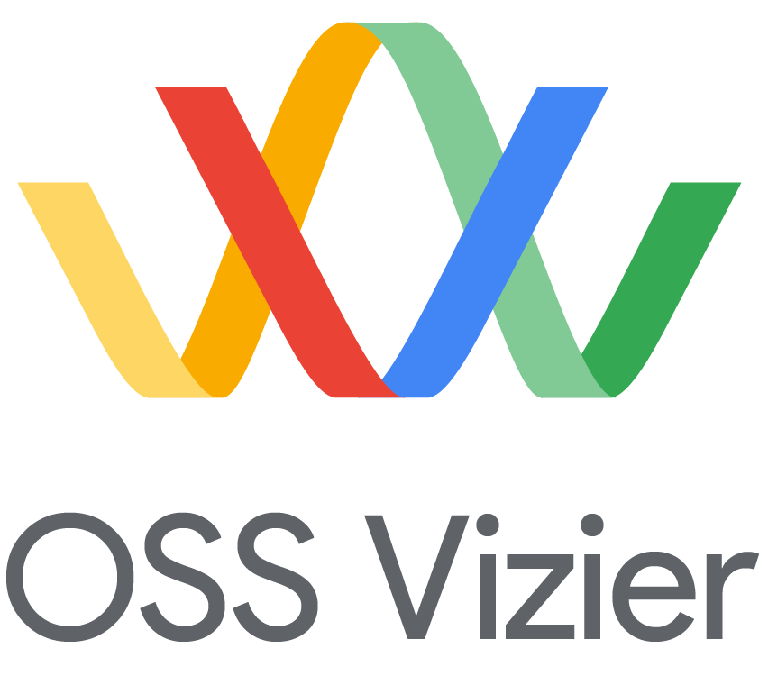
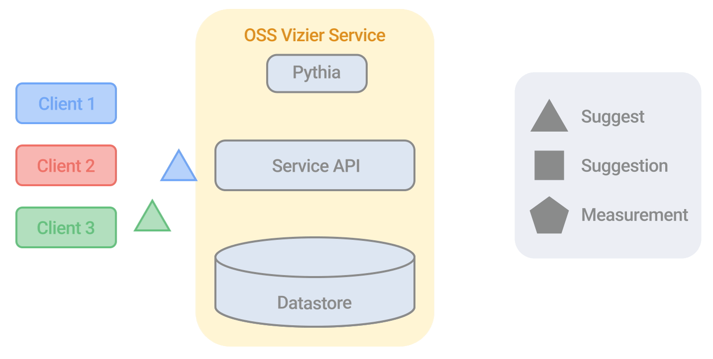

<figure>

</figure>

# Open Source Vizier: Reliable and Flexible Black-Box Optimization.
[](https://badge.fury.io/py/google-vizier)
[](https://github.com/google/vizier/actions/workflows/ci.yml?query=branch%3Amain)


  [**Google AI Blog**](https://ai.googleblog.com/2023/02/open-source-vizier-towards-reliable-and.html)
| [**Getting Started**](#getting_started)
| [**Documentation**](#documentation)
| [**Installation**](#installation)
| [**Citing and Highlights**](#citing_vizier)

## What is Open Source (OSS) Vizier?
[OSS Vizier](https://arxiv.org/abs/2207.13676) is a Python-based service for black-box optimization and research, based on [Google Vizier](https://dl.acm.org/doi/10.1145/3097983.3098043), one of the first hyperparameter tuning services designed to work at scale.

<figure>
<p align="center" width=65%>

  <br>
  <em><b>OSS Vizier's distributed client-server system. Animation by Tom Small.</b></em>
</p>
</figure>

## Getting Started <a name="getting_started"></a>
As a basic example for users, below shows how to tune a simple objective using all flat search space types:

```python
from vizier.service import clients
from vizier.service import pyvizier as vz

# Objective function to maximize.
def evaluate(w: float, x: int, y: float, z: str) -> float:
  return w**2 - y**2 + x * ord(z)

# Algorithm, search space, and metrics.
study_config = vz.StudyConfig(algorithm='DEFAULT')
study_config.search_space.root.add_float_param('w', 0.0, 5.0)
study_config.search_space.root.add_int_param('x', -2, 2)
study_config.search_space.root.add_discrete_param('y', [0.3, 7.2])
study_config.search_space.root.add_categorical_param('z', ['a', 'g', 'k'])
study_config.metric_information.append(vz.MetricInformation('metric_name', goal=vz.ObjectiveMetricGoal.MAXIMIZE))

# Setup client and begin optimization. Vizier Service will be implicitly created.
study = clients.Study.from_study_config(study_config, owner='my_name', study_id='example')
for i in range(10):
  suggestions = study.suggest(count=2)
  for suggestion in suggestions:
    params = suggestion.parameters
    objective = evaluate(params['w'], params['x'], params['y'], params['z'])
    suggestion.complete(vz.Measurement({'metric_name': objective}))
```

## Documentation <a name="documentation"></a>
OSS Vizier's interface consists of [three main APIs](https://oss-vizier.readthedocs.io/en/latest/guides/index.html):

* [**User API:**](https://oss-vizier.readthedocs.io/en/latest/guides/index.html#for-users) Allows a user to optimize their blackbox objective and optionally setup a server for distributed multi-client settings.
* [**Developer API:**](https://oss-vizier.readthedocs.io/en/latest/guides/index.html#for-developers) Defines abstractions and utilities for implementing new optimization algorithms for research and to be hosted in the service.
* [**Benchmarking API:**](https://oss-vizier.readthedocs.io/en/latest/guides/index.html#for-benchmarking) A wide collection of objective functions and methods to benchmark and compare algorithms.

Additionally, it contains [advanced API](https://oss-vizier.readthedocs.io/en/latest/advanced_topics/index.html) for:

* [**Tensorflow Probability:**](https://oss-vizier.readthedocs.io/en/latest/advanced_topics/index.html#tensorflow-probability) For writing Bayesian Optimization algorithms using Tensorflow Probability and Flax.
* [**PyGlove:**](https://oss-vizier.readthedocs.io/en/latest/advanced_topics/index.html#pyglove) For large-scale evolutionary experimentation and program search using OSS Vizier as a distributed backend.

Please see OSS Vizier's [ReadTheDocs documentation](https://oss-vizier.readthedocs.io/) for detailed information.

## Installation <a name="installation"></a>
**Quick start:** For tuning objectives using our state-of-the-art JAX-based Bayesian Optimizer, run:

```bash
pip install google-vizier[jax]
```

### Advanced Installation
**Minimal version:** To install only the core service and client APIs from `requirements.txt`, run:

```bash
pip install google-vizier
```

**Full installation:** To support all algorithms and benchmarks, run:

```bash
pip install google-vizier[all]
```

**Specific installation:** If you only need a specific part "X" of OSS Vizier, run:

```bash
pip install google-vizier[X]
```

which installs add-ons from `requirements-X.txt`. Possible options:

* `requirements-jax.txt`: Jax libraries shared by both algorithms and benchmarks.
* `requirements-tf.txt`: Tensorflow libraries used by benchmarks.
* `requirements-algorithms.txt`: Additional repositories (e.g. EvoJAX) for algorithms.
* `requirements-benchmarks.txt`: Additional repositories (e.g. NASBENCH-201) for benchmarks.
* `requirements-test.txt`: Libraries needed for testing code.

Check if all unit tests work by running `run_tests.sh` after a full installation. OSS Vizier requires Python 3.10+, while client-only packages require Python 3.8+.

## Citing and Highlights <a name="citing_vizier"></a>
<ins>**Citing Vizier:**</ins> If you found this code useful, please consider citing the [OSS Vizier paper](https://arxiv.org/abs/2207.13676) as well as the [Google Vizier paper](https://dl.acm.org/doi/10.1145/3097983.3098043).

<ins>**Highlights:**</ins> We track [notable users](https://oss-vizier.readthedocs.io/en/latest/highlights/applications.html) and [media attention](https://oss-vizier.readthedocs.io/en/latest/highlights/media.html) - let us know if OSS Vizier was helpful for your work.

Thanks!

```bibtex
@inproceedings{oss_vizier,
  author    = {Xingyou Song and
               Sagi Perel and
               Chansoo Lee and
               Greg Kochanski and
               Daniel Golovin},
  title     = {Open Source Vizier: Distributed Infrastructure and API for Reliable and Flexible Black-box Optimization},
  booktitle = {Automated Machine Learning Conference, Systems Track (AutoML-Conf Systems)},
  year      = {2022},
}

@inproceedings{google_vizier,
  author    = {Daniel Golovin and
               Benjamin Solnik and
               Subhodeep Moitra and
               Greg Kochanski and
               John Karro and
               D. Sculley},
  title     = {Google Vizier: {A} Service for Black-Box Optimization},
  booktitle = {Proceedings of the 23rd {ACM} {SIGKDD} International Conference on
               Knowledge Discovery and Data Mining, Halifax, NS, Canada, August 13
               - 17, 2017},
  pages     = {1487--1495},
  publisher = {{ACM}},
  year      = {2017},
  url       = {https://doi.org/10.1145/3097983.3098043},
  doi       = {10.1145/3097983.3098043},
}
```
