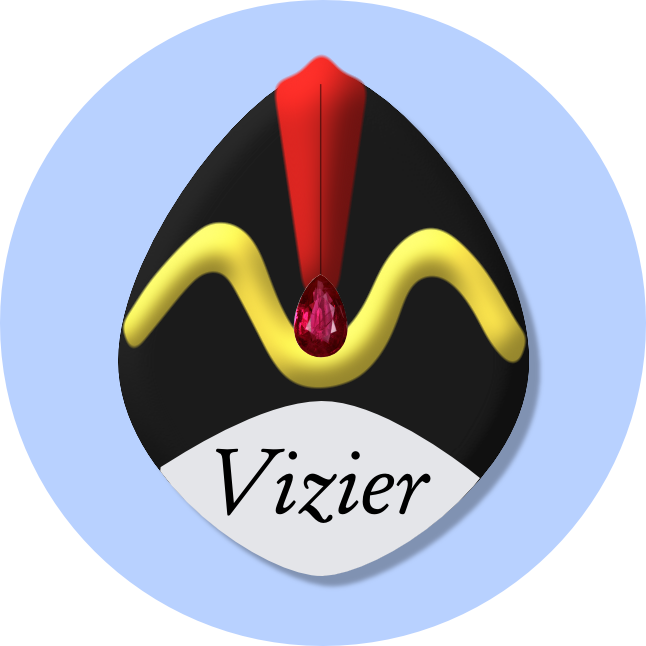

<figure>

</figure>

# Open Source Vizier: Reliable and Flexible Blackbox Optimization.


[**Documentation**](https://oss-vizier.readthedocs.io/)
| [**Installation**](#installation)
| [**User API**](#user_api)
| [**Developer API**](#developer_api)
| [**Code Structure**](#code_structure)
| [**Citing Vizier**](#citing_vizier)


## What is Open Source (OSS) Vizier?

OSS Vizier is a Python-based interface for blackbox optimization and research, based on [Google Vizier](https://dl.acm.org/doi/10.1145/3097983.3098043), one of the first hyperparameter tuning services designed to work at scale.

It consists of two main APIs:

* **User API:** Allows a user to setup a main Vizier Server, which can host blackbox optimization algorithms to serve multiple clients simultaneously in a fault-tolerant manner to tune their objective functions.
* **Developer API:** Defines abstractions and utilities for implementing new optimization algorithms for research and benchmarking.


## Installation <a name="installation"></a>
The simplest way is to run the provided `install.sh`. It installs the necessary dependencies, and builds the relevant protobuf libraries needed for the service. Check if all unit tests work by running `run_tests.sh`. OSS Vizier requires Python 3.9+.

## User API: Running Vizier <a name="user_api"></a>
An example of the entire server + client loop running locally can be found in the unit test file `vizier/service/vizier_client_test.py`. A manual demo can be found in the `/demos/` folder. To run the manual demo, run the following command to start the server:

```
python run_vizier_server.py
```

which will print out an `address` of the form `localhost:[PORT]`.

Then run the following command using the `address` to start the client:

```
python run_vizier_client.py --address="localhost:[PORT]"
```

We explain how the core components work below:

### Running the Server <a name="running_server"></a>
To start the Vizier service, the standard way via GRPC is to do the following on the host machine:

```python
import grpc
import portpicker

# Setup Vizier Service and its data.
servicer = vizier_server.VizierService()

# Setup local networking.
port = portpicker.pick_unused_port()
address = f'localhost:{port}'

# Setup server.
server = grpc.server(futures.ThreadPoolExecutor(max_workers=100))

vizier_service_pb2_grpc.add_VizierServiceServicer_to_server(servicer, server)
server.add_secure_port(address, grpc.local_server_credentials())
server.start()
```

### Running a client <a name="running_client"></a>
The user may then interact with the service via the client interface. The user first needs to setup the search space, metrics, and algorithm, in the `StudyConfig`:

```python
from vizier.service import pyvizier as vz

study_config = vz.StudyConfig() # Search space, metrics, and algorithm.
root = study_config.search_space.select_root() # "Root" params must exist in every trial.
root.add_float_param('learning_rate', min_value=1e-4, max_value=1e-2, scale_type=vz.ScaleType.LOG)
root.add_int_param('num_layers', min_value=1, max_value=5)
study_config.metric_information.append(vz.MetricInformation(name='accuracy', goal=vz.ObjectiveMetricGoal.MAXIMIZE, min_value=0.0, max_value=1.0))
study_config.algorithm = vz.Algorithm.RANDOM_SEARCH
```

Using the `address` created above in the server section, we may now create the client (e.g. on a worker machine different from the server):

```python
from vizier.service import vizier_client

client = vizier_client.create_or_load_study(
    service_endpoint=address,  # Same address as server.
    owner_id='my_name',
    client_id='my_client_id',
    study_display_name='cifar10',
    study_config=study_config)
```

Note that the above can be called multiple times, one on each machine, to obtain `client_2`, `client_3`,..., all working on the same study, especially for tuning jobs which require multiple machines to parallelize the workload.

Each client may now send requests to the server and receive responses, for example:

```python
client.list_trials()  # List out trials for the corresponding study.
client.get_trial(trial_id=1)  # Get the first trial.
```

The default usage is to tune a user defined blackbox objective `evaluate_trial()`, with an example shown below:

```python
suggestions = client.get_suggestions(suggestion_count=5)  # Batch of 5 suggestions.
# Evaluate the suggestion(s) and report the results to Vizier.
for trial in suggestions:
  measurement = evaluate_trial(trial)
  client.complete_trial(trial_id, measurement)
```

The Vizier service is designed to handle multiple concurrent clients all requesting suggestions and returning metrics.

## Developer API: Writing Algorithms <a name="developer_api"></a>

### Pythia Policy is what runs in Vizier service.

Vizier server keeps a mapping between algorithm names and `Policy` objects ([Example](http://github.com/google/vizier/tree/main/vizier/service/vizier_server.py)). All algorithm implementations
must be eventually wrapped into `Policy`.

However, you should directly subclass a `Policy` **only if you are an advanced user
and wants to fully control the algorithm behavior** including all database
operations. For all other developers, we recommend using an alternative abstraction
listed in the remainder of this section.

A typical `Policy` implementation is injected with a `PolicySupporter`, which is
used for fetching data.
For a minimal example, see [`RandomPolicy`](http://github.com/google/vizier/tree/main/vizier/_src/algorithms/policies/random_policy.py).

To interact with a `Policy` locally, you can use
`LocalPolicyRunner` which is a local in-ram server-client for `Policy`.
For implementing a policy, one should use `vizier.pyvizier` instead of
`vizier.service.pyvizier` library. The former is platform-independent, and the
latter is platform-dependent. The most notable difference is that
`vizier.pyvizier.ProblemStatement` is a subset of `vizier.service.pyvizier.ProblemStatement`
that does not carry any service-related attributes (such as study identifier
and algorithms).

```python
from vizier.pythia import Policy, LocalPolicyRunner
from vizier import pyvizier as vz

problem = vz.ProblemStatement()
problem.search_space.select_root().add_float_param('x', 0.0, 1.0)
problem.metric_information.append(
    vz.MetricInformation(name='objective', goal=vz.MetricInformation.MAXIMIZE))

runner = LocalPolicyRunner(problem)
policy = MyPolicy(runner)

# Run for 10 iterations, each of which evaluates 5 new trials.
for _ in range(10):
  new_trials = runner.SuggestTrials(policy, 5)
  for trial in new_trials:
    trial.complete(vz.Measurement(
        {'objective': trial.parameters_dict['x'] ** 2}))
```


### Designer API is the recommended starting point

[`Designer`](http://github.com/google/vizier/tree/main/vizier/_src/algorithms/core/abstractions.py)
API provides a simplified entry point for implementing suggestion algorithms. For a minimal example, see [`EmukitDesigner`](http://github.com/google/vizier/tree/main/vizier/_src/algorithms/designers/emukit.py) which wraps GP-EI algorithm implemented in `emukit` into `Designer` interface. `Designer`s are trivially wrapped into `Policy` via [`DesignerPolicy`](http://github.com/google/vizier/tree/main/vizier/_src/algorithms/policies/designer_policy.py).


Also see our [designer testing routine](http://github.com/google/vizier/tree/main/vizier/_src/algorithms/testing/test_runners.py)
for an up-to-date example on how to interact with designers.

The `Designer` interface is designed to let you forget about the ultimate goal
of serving the algorithm in a distributed environment. Pretend you'll use it
locally by doing a suggest-update loop in RAM, during the lifetime of a study.


#### Serializing your designer

You can consider making your `Designer` serializable so that you can save and
load its state. Vizier offers [two options](http://github.com/google/vizier/tree/main/vizier/interfaces/serializable.py):

* `Serializable` should be used if your algorithm can be easily serialized. You
can save and restore the state in full.
* `PartiallySerializable` should be used if your algorithm has subcomponents
that are not easily serializable. You can recover the designer's state as long
as it was initialized with the same arguments.

For an example of a `Serializable` object, see [`Population`](http://github.com/google/vizier/tree/main/vizier/_src/algorithms/evolution/numpy_populations.py),
which is the internal state used by NSGA2. [NSGA2 itself](http://github.com/google/vizier/tree/main/vizier/_src/algorithms/evolution/templates.py) is only
`PartiallySerializable` so that people can easily plug in their own mutation
and selection operations without worrying about serializations.

Serialization also makes your `Designer` run faster if its state size scales sublinearly in the number of observed Trials. For example, typical evolution algorithms and metaheuristics qualify, while GP-based algorithms do not because they use a non-parametric model. All you have to do is wrap your `(Partially)SerializableDesigner` into `(Partially)SerializableDesignerPolicy`, which takes care of the state management.


## Code Structure <a name="code_structure"></a>

### Frequently used import targets <a name="freq_import_targets"></a>

Includes a brief summary of important symbols and modules.

#### Service users <a name="service_users"></a>
* `from vizier.service import pyvizier as vz`: Exposes the same set of symbol names as `vizier.pyvizier`. `vizier.service.pyvizier.Foo` is a subclass or an alias of `vizier.pyvizier.Foo`, and can be converted into protobufs.
<!-- TODO(b/226560768): Update this entry after the clean up -->
* `from vizier.service import ...`: Include binaries and internal utilities.

#### Developer essentials
* **`from vizier import pyvizier as vz`**: Pure python building blocks of Vizier. Cross-platform code including pythia policies must use this pyvizier instance.
  * `Trial` and `StudyConfig` are most important classes.
* **`from vizier.pyvizier import converters`**: Convert between pyvizier objects and numpy arrays.
  * `TrialToNumpyDict`: Converts parameters (and metrics) into a dict of numpy arrays. Preferred conversion method if you intended to train an embedding of categorical/discrete parameters, or data includes missing parameters or metrics.
  * `TrialToArrayConverter`: Converts parameters (and metrics) into an array.
* `from vizier.interfaces import serializable`
  * `PartiallySerializable`, `Serializable`

#### Algorithm abstractions
* **`from vizier import pythia`**
  * `Policy`, `PolicySupporter`: Key abstractions
  * `LocalPolicyRunner`: Use it for running a `Policy` in RAM.
* **`from vizier import algorithms`**
  * `Designer`:
  * `DesignerPolicy`: Wraps `Designer` into a pythia Policy.
  * `GradientFreeMaximizer`: For optimizing acquisition functions.
  * `(Partially)SerializableDesigner`: Designers who wish to optimize performance by saving states.

#### Tensorflow modules
* **`from vizier import tfp`**: Tensorflow-probability utilities.
  * `acquisitions`: Acquisition functions module.
     * `AcquisitionFunction`: abstraction
     * `UpperConfidenceBound`, `ExpectedImprovement`, etc.
  * `bijectors`: Bijectors module.
    * `YeoJohnson`: Implements both Yeo-Johnson and Box-Cox transformations.
    * `optimal_power_transformation`: Returns the optimal power transformation.
    * `flip_sign`: returns a sign-flip bijector.
* **`from vizier import keras as vzk`**
  * `vzk.layers`: Layers usually wrapping tfp classes
      * `variable_from_prior`: Utility layer for handling regularized variables.
  * `vzk.optim`: Wrappers around optimizers in tfp or keras
  * `vzk.models`: Most of the useful models don't easily fit into keras' Model abstraction, but we may add some for display.


## Citing Vizier <a name="citing_vizier"></a>
If you found this code useful, please consider citing the [OSS Vizier paper](https://openreview.net/forum?id=SfIRlTSUxc) as well as the [Google Vizier paper](https://dl.acm.org/doi/10.1145/3097983.3098043). Thanks!

```
@inproceedings{oss_vizier,
  author    = {Xingyou Song and
               Sagi Perel and
               Chansoo Lee and
               Greg Kochanski and
               Daniel Golovin},
  title     = {Open Source Vizier: Distributed Infrastructure and API for Reliable and Flexible Blackbox Optimization},
  booktitle = {Automated Machine Learning Conference, Systems Track (AutoML-Conf Systems)}
  year      = {2022},
}
@inproceedings{google_vizier,
  author    = {Daniel Golovin and
               Benjamin Solnik and
               Subhodeep Moitra and
               Greg Kochanski and
               John Karro and
               D. Sculley},
  title     = {Google Vizier: {A} Service for Black-Box Optimization},
  booktitle = {Proceedings of the 23rd {ACM} {SIGKDD} International Conference on
               Knowledge Discovery and Data Mining, Halifax, NS, Canada, August 13
               - 17, 2017},
  pages     = {1487--1495},
  publisher = {{ACM}},
  year      = {2017},
  url       = {https://doi.org/10.1145/3097983.3098043},
  doi       = {10.1145/3097983.3098043},
}
```
